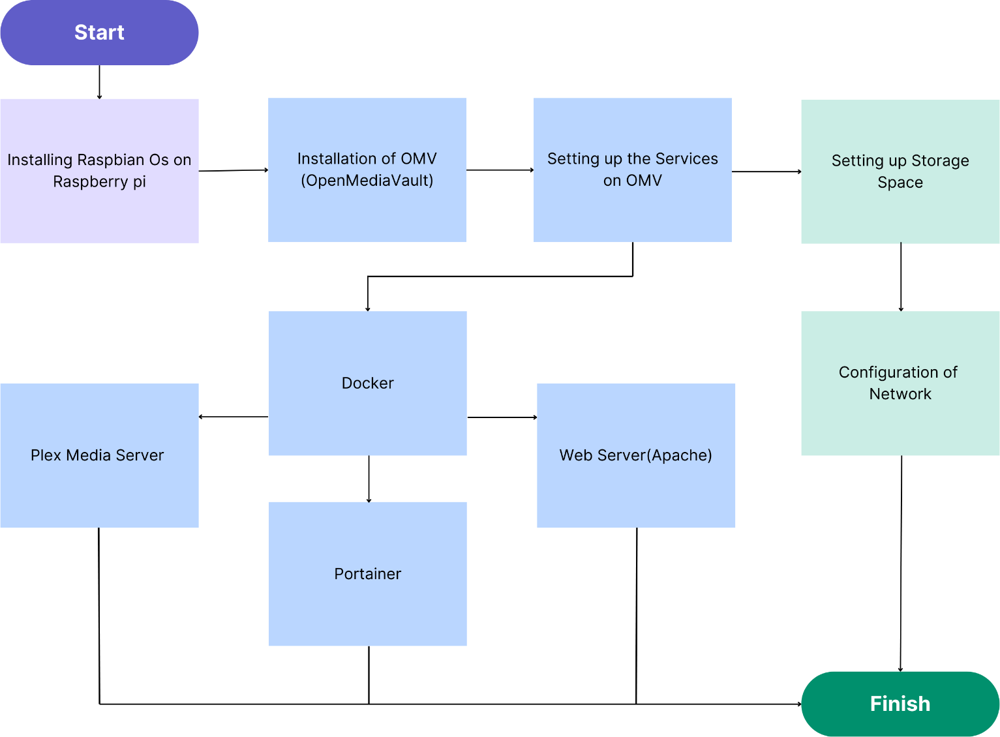

# 🍓 Raspberry Pi NAS with OMV, Docker, and Services

A complete self-hosted NAS solution built on Raspberry Pi using:
- Raspbian OS
- OpenMediaVault
- Docker & Portainer
- Plex Media Server
- Apache Web Server
- Configurable Storage & Networking

---

## 🚀 Getting Started

### 📁 Documentation
Each setup step is documented in the [`docs/`](./docs) folder:

| Step                                     | Description                  |
| ---------------------------------------- | ---------------------------- |
| [01](./docs/01-raspbian-setup.md)        | Installing Raspbian OS       |
| [02](./docs/02-omv-installation.md)      | Installing OpenMediaVault    |
| [03](./docs/03-docker-portainer.md)      | Docker + Portainer Setup     |
| [04](./docs/04-plex-media-server.md)     | Plex Media Server Deployment |
| [05](./docs/05-apache-web-server.md)     | Apache Web Server Setup      |
| [06](./docs/06-storage-setup.md)         | Mounting & Managing Storage  |
| [07](./docs/07-network-configuration.md) | Network Configuration        |

---

## ⚙️ Configs & Scripts

| Folder                  | Purpose                             |
| ----------------------- | ----------------------------------- |
| [`docker/`](./docker)   | All Docker Compose files            |
| [`config/`](./config)   | Apache and OMV settings             |
| [`scripts/`](./scripts) | Installation and automation scripts |

---

## 🖼 Architecture

---

## 📦 Rebuild This Project

Clone the repo, follow the guides in `docs/`, and apply the Docker configs in `docker/` to rebuild this Raspberry Pi NAS from scratch.

---

## 🙌 Contribution & License

MIT Licensed • Built by [Suyash Gurav](https://github.com/guravsuyash)
